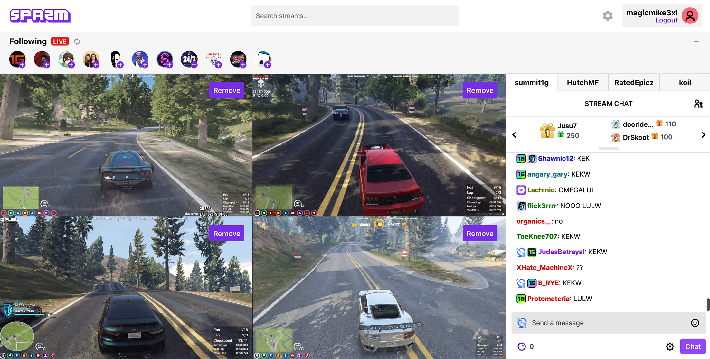
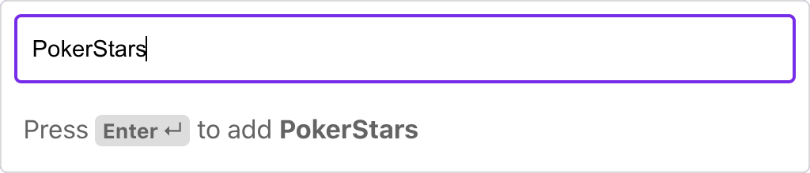
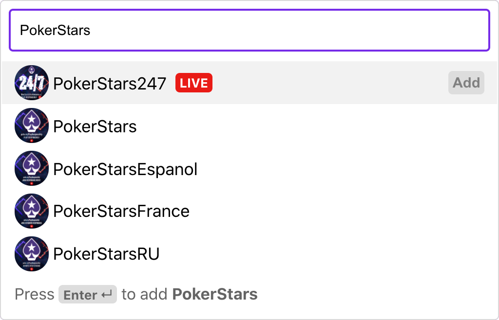
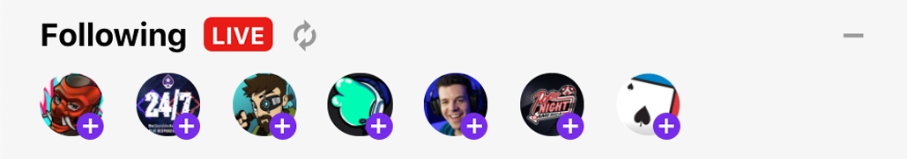

# spazm

*spazm is a simple multi-stream viewer used to watch multiple Twitch streams simultaneously. Users can sign in with their twitch account to view live followed streams.*
  

## Features & UI

spazm is perfect for viewing multiple perspectives of multiplayer servers / livestream events or for just keeping up with several of your favorite streamers simultaneously.  Embedded streams and chats are automatically connected to your Twitch account *(whether logged in or not)*, so you can enjoy any follower / subscriber benefits through the spazm interface as well. 

**Unauthenticated** users can use the search bar to add streams by typing in the channel name of the stream they'd like to add. 

**Authenticated** users can additionally search for streams, view search results automatically, and see which of the resulting users are currently live. 

Authenticated users can also see a list of their followed channels who are currently live and add streams directly from their **Following panel**. You can refresh your following list by clicking the *refresh button* or minimize the list to maximize stream sizes by clicking the *minus button* on the right.

## Install & Run Locally

* Run `git clone https://github.com/mhollingshead/spazm.git` to clone the project directory, then run `cd ./spazm-main`. 

  *Alternatively, you can download the project directory `spazm-main.zip`  [here](https://github.com/mhollingshead/spazm/archive/refs/heads/main.zip), unzip and `cd` into `./spazm-main`.*

* spazm uses the [Twitch API](https://dev.twitch.tv/docs/api) to make requests and authenticate users. This means that in order to run locally, you'll need to register a new application in your [Twitch Developer Console](https://dev.twitch.tv/). 

* Once you've registered your application, navigate to the **Manage Application** page. In the **OAuth Redirect URLs** section, add `http://localhost:3000/auth/twitch/callback`. You'll also want to make a note of your `Client ID` and `Client Secret`. 

	*Your client ID and secret should always remain private, **do not share these values with anybody**.*

* Rename `.env.sample` to `.env` and set the `REACT_APP_CLIENT_ID` and `REACT_APP_CLIENT_SECRET` variables to the `Client ID` and `Client Secret` from the previous step.

* Finally, run `npm i` to install the necessary dependencies, then run `npm dev` to start the client and server simultaneously. The default `PORT` for the server is `8080`.

If you followed the steps above, a new tab should open to http://localhost:3000 where you should be able to start using spazm.